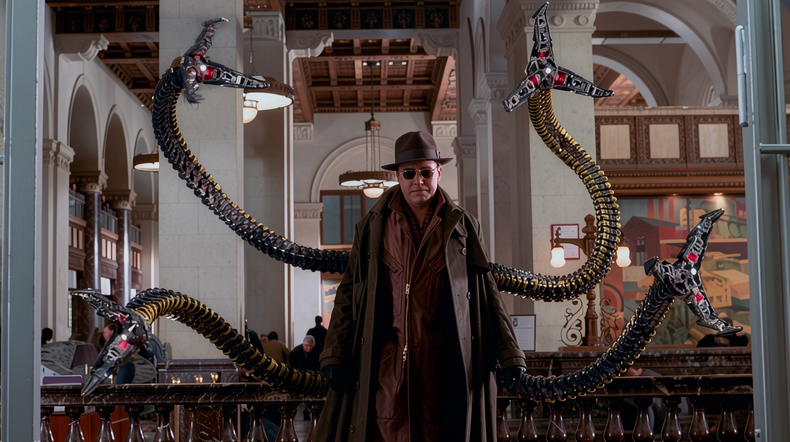
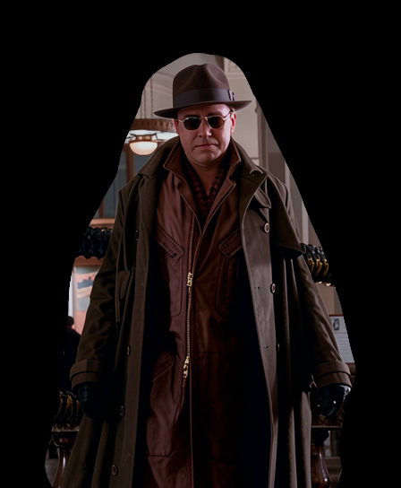

# ComfyUI Masked Global Color Match

### Source image: **Original Image** and **Cropped Sample for Inpaint** (Mask inverted for sample_mask node)



### Flux Klein 9b Output: **Raw** vs **Color Matched**


### Stitched results: **Raw** vs **Color Matched**
(Masked region is visible due to Color burn/Color shift).\


This is a handy little custom node for ComfyUI that helps fix color and contrast shifts in your images using a specific reference area. 

Instead of doing a blind global guess, this node looks at a masked area, figures out the exact color and contrast differences between your original photo and the edited one, and applies that mathematical correction to your whole canvas. Think of it as a highly targeted color grading transfer.

## Why I Created This

I actually built this node specifically to deal with Flux. If you use Flux for inpainting or img2img, you've probably noticed it tends to introduce an annoying global color shift or flatten the contrast across your entire generation. This node exists to solve that exact problem—it snaps your Flux edit's colors and lighting depth directly back to the original photo's baseline without losing any of the new inpaint details.

## What It Does

* **Samples locally, fixes globally:** You mask a specific spot (like a face or a wall) to check the colors, but the color correction applies to the entire image.
* **Matches color and contrast:** It converts images to the LAB color space and calculates both the mean (average color) and standard deviation (contrast/variance). It then uses the Reinhard formula to match the edited image's lighting depth exactly to the original.
* **Chill failsafe:** If you accidentally pass an empty mask, it won't crash your workflow. It just passes the edited image straight through.

## How to Install

1. Open your terminal and navigate to your ComfyUI `custom_nodes` folder.
2. Clone the repository:
   ```bash
   git clone [https://github.com/butchpaolom/ComfyUI-Inpaint-Color-Match-Global.git](https://github.com/butchpaolom/ComfyUI-Inpaint-Color-Match-Global.git)

## Node Inputs & Outputs

* **original_image (Input)**: Your baseline image that has the nice, correct colors you want to keep.
* **edited_image (Input)**: The AI-generated image that needs a little color help.
* **sample_mask (Input)**: Inverted mask of the inpainted region.
* **corrected_image (Output)**: Your final image, globally color-corrected.